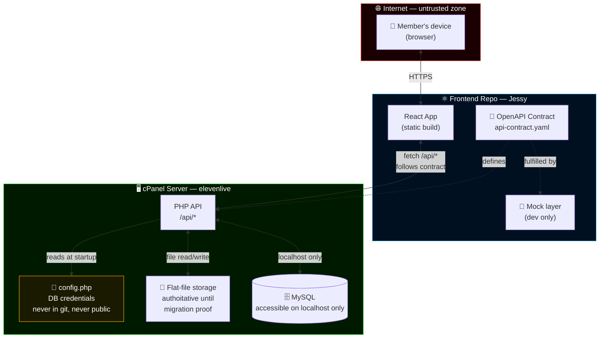
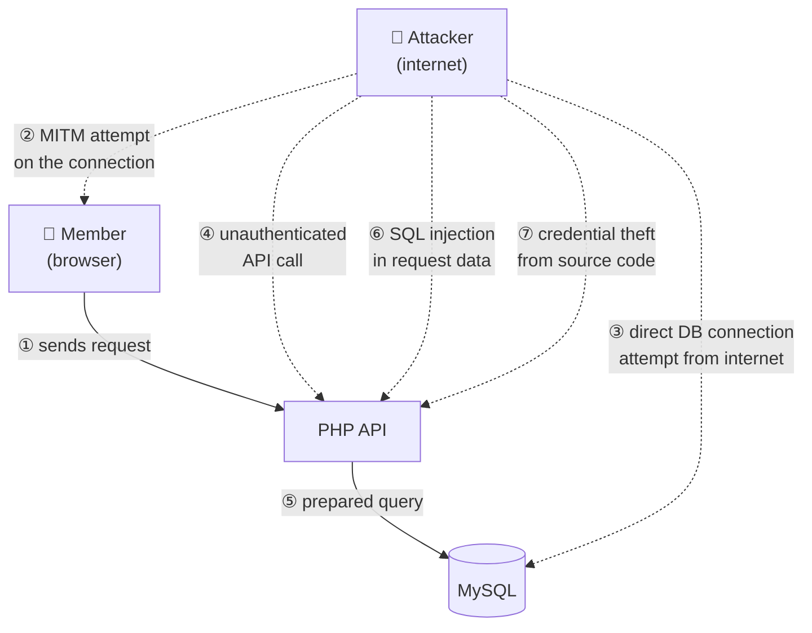
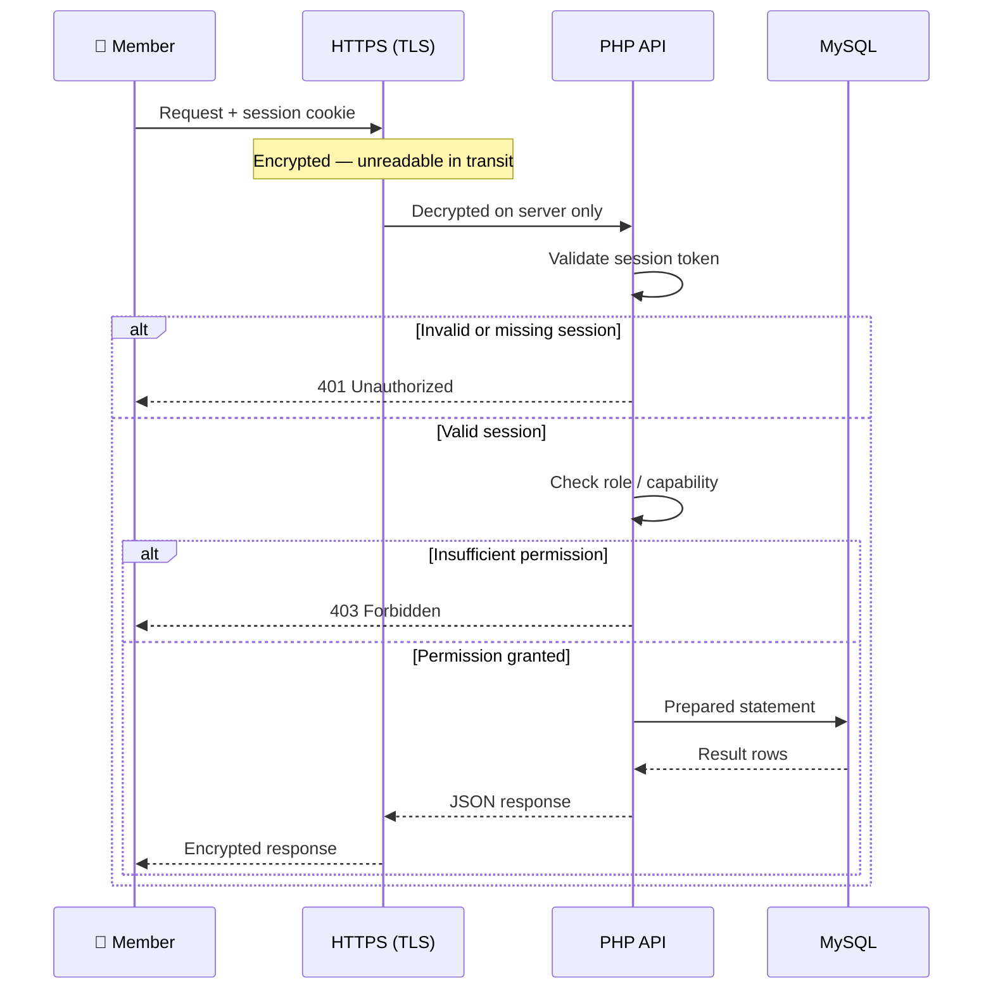

# Architecture

## Repository Split

Two repositories, one hard boundary.

| Repository | Owner | Responsibility |
|---|---|---|
| `elevenlive/sonneark-website` | elevenlive | PHP API, MySQL, flat-file storage, auth, all server-side logic |
| `realMoebius/sonneark-frontend` | Jessy | React (Vite), UI components, OpenAPI contract, mock layer |

elevenlive develops the PHP layer autonomously — he owns the hosting, the database, the file structure. Jessy develops the React layer against the API contract and mock data. Neither side needs access to the other's internals.

The OpenAPI contract (`docs/api-contract.yaml`) lives in the frontend repo and is the single source of truth for the boundary between them.

---

## Stack

| Layer | Technology | Hosting | Owner |
|---|---|---|---|
| Frontend | React (Vite) — static build | cPanel (existing) | Jessy |
| API Contract | OpenAPI 3.1 YAML | frontend repo | Jessy |
| Backend | PHP REST API | cPanel (existing) | elevenlive |
| Storage | MySQL + flat-file (hybrid) | cPanel (existing) | elevenlive |
| Auth | PHP sessions | cPanel (existing) | elevenlive |
| CI/CD | GitHub Actions (build) | GitHub | Jessy |
| Domain | sonneark.eu | existing | elevenlive |

No new hosting. No new services. Everything runs on elevenlive's existing cPanel.

---

## How it works

```
Frontend repo (React)
  → push to main
  → GitHub Actions builds React to /dist
  → elevenlive deploys /dist to cPanel (reviewed, gated)
  → cPanel serves: index.html (React SPA) + /api/* (PHP)

React → fetch /api/* → PHP reads MySQL / flat-files → JSON response
```

The domain and nameservers stay exactly as they are.

---

## Where data lives



The database has no public port. Flat-file data never leaves the server. The only path from the internet to data is through the PHP API.

---

## Storage model

The existing site uses a hybrid of flat-file storage and MySQL. Both must be respected.

| Data type | Storage | Why |
|---|---|---|
| Guide content | Flat-file (JSON/Markdown) | Existing authority — do not replace without migration proof |
| Site configuration | Flat-file (PHP/JSON) | Hosting-level, never in git |
| Translations | Flat-file or MySQL | Verify in Phase 0 |
| User accounts | MySQL (likely) | Verify in Phase 0 |
| Forum posts | MySQL | Structured queries needed |
| Notifications | MySQL | New feature, built clean |
| Audit log | MySQL | New feature, built clean |
| Event schedule | Flat-file → MySQL | Officers need to edit; migrate when UI is ready |

**Rule:** flat-file data is not casually moved to MySQL. Any migration needs a versioned script, a backup, a rollback plan, and elevenlive approval.

---

## Attack vectors and defenses



| # | Attack | Defense |
|---|---|---|
| ② | Man-in-the-middle | HTTPS/TLS encrypts all traffic. |
| ③ | Direct database connection from the internet | MySQL bound to localhost only. No open port. |
| ④ | API call without a valid session | PHP checks session on every request. No token = no data. |
| ⑤ | Reading data the member is not permitted to see | PHP checks role and capabilities before any query. |
| ⑥ | SQL injection | All queries use PDO prepared statements. |
| ⑦ | Credential theft from source code | Credentials in `private/config.php`, outside web root, excluded from git. |

---

## A request from login to data



---

## Principles

- Mobile-first — the game is played on mobile, the website must work on mobile in under 3 seconds
- Hard API boundary — frontend and backend are independently deployable
- Flat-file first — existing data is not moved to MySQL without proof and rollback
- Ship working software — 80% done and deployed beats 100% done and waiting
- Manual before automated — prove demand before building pipelines

## Future cost threshold

Only if the project outgrows cPanel:
- Vercel for React hosting ($0 → stays free longer)
- Supabase for database ($25/month Pro, only if MySQL on cPanel becomes a bottleneck)

These are not planned. They are escape hatches if needed.
