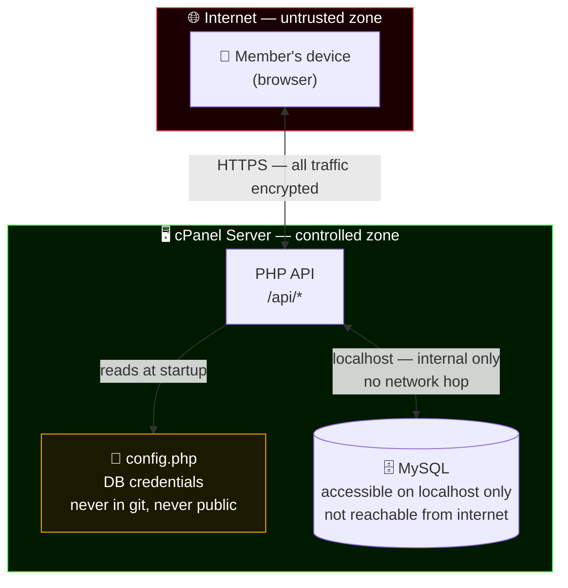
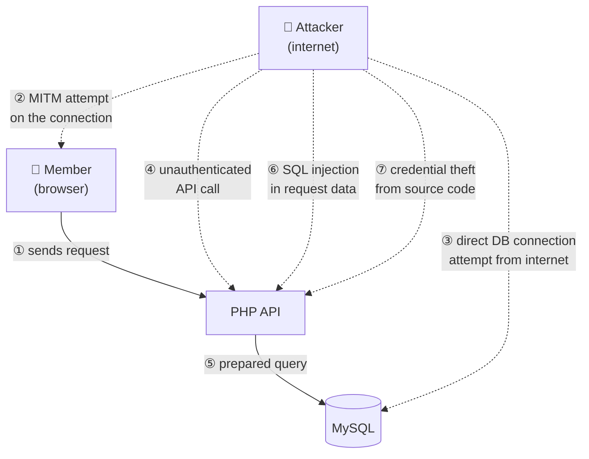
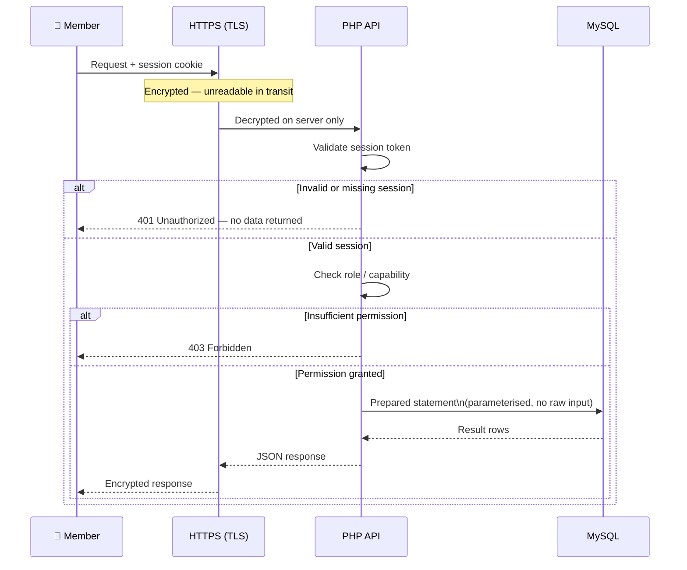

# Architecture

## Stack

| Layer | Technology | Hosting | Cost |
|---|---|---|---|
| Frontend | React (Vite) — static build | cPanel (existing) | $0 |
| Backend | PHP REST API | cPanel (existing) | $0 |
| Database | MySQL | cPanel (existing) | $0 |
| Auth | PHP sessions + JWT | cPanel (existing) | $0 |
| CI/CD | GitHub Actions (build + deploy) | GitHub | $0 |
| Domain | sonneark.eu | existing | $0 |

No new hosting. No new services. Everything runs on elevenlive's existing cPanel.

## How it works

```
GitHub repo (React + PHP)
  → push to main
  → GitHub Actions builds React to /dist
  → deploys via git to cPanel
  → cPanel serves: index.html (React SPA) + /api/* (PHP)
```

React talks to the PHP API via fetch. PHP reads and writes MySQL.
The domain and nameservers stay exactly as they are.

---

## Where data lives



The database has no public port. It only answers to processes running on the same server.
An attacker on the internet has no path to MySQL directly — the only way in is through the PHP API.

---

## Attack vectors and defenses



| # | Attack | Defense |
|---|---|---|
| ② | Man-in-the-middle — intercept traffic between member and server | HTTPS/TLS encrypts all traffic. Intercepted packets are unreadable without the server's private key. |
| ③ | Direct database connection from the internet | MySQL is bound to localhost only. No port is open to the internet. There is nothing to connect to. |
| ④ | API call without a valid session | PHP checks the session token on every request before touching the database. No token = no data. |
| ⑤ | Reading data the member is not allowed to see | PHP checks the member's role and capabilities before executing any query. Permission is enforced in code, not just in the UI. |
| ⑥ | SQL injection — sending malicious input to manipulate a query | All queries use PDO prepared statements. User input is never concatenated into SQL. |
| ⑦ | Stealing database credentials from the source code | Credentials live in `private/config.php`, which is outside the public web root and excluded from git. GitHub never sees them. |

---

## A request from login to data



Data never leaves the server unencrypted. A member only receives the data their role permits. The database is never queried with raw user input.

---

## Principles

- Mobile-first — the game is played on mobile, the website must work on mobile in under 3 seconds
- Ship working software — 80% done and deployed beats 100% done and waiting
- Backlog over bloat — new ideas go into the backlog, not the current sprint
- Manual before automated — prove demand before building pipelines

## What carries over

- Existing MySQL database and schema
- PHP for all backend logic and API routes
- cPanel git deployment (already in place)
- Domain and nameservers untouched
- Design system (site.css) as reference for React components
- Guide content — migrated as structured data
- Multilingual architecture — preserved

## What changes

- Frontend becomes React instead of PHP-rendered HTML
- No more mixed PHP/HTML templates — clean API separation
- TypeScript on the frontend for type safety
- GitHub Actions automates the build step before git deployment

## Future cost threshold

Only if the project outgrows cPanel:
- Vercel for React hosting ($0 → stays free longer)
- Supabase for database ($25/month Pro, only if MySQL on cPanel becomes a bottleneck)

These are not planned. They are escape hatches if needed.
