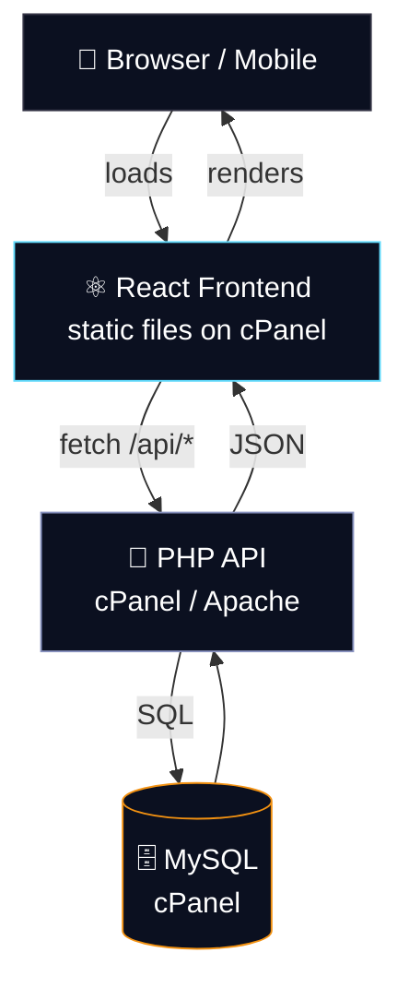
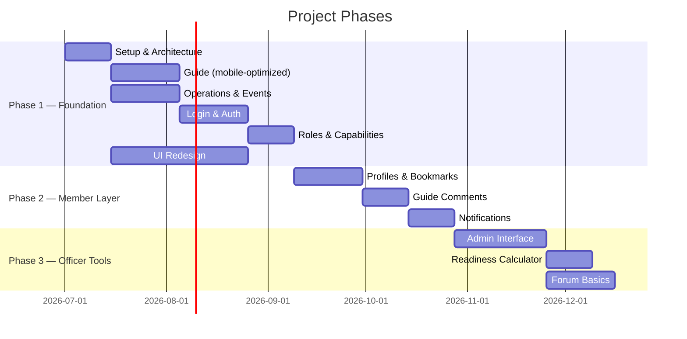
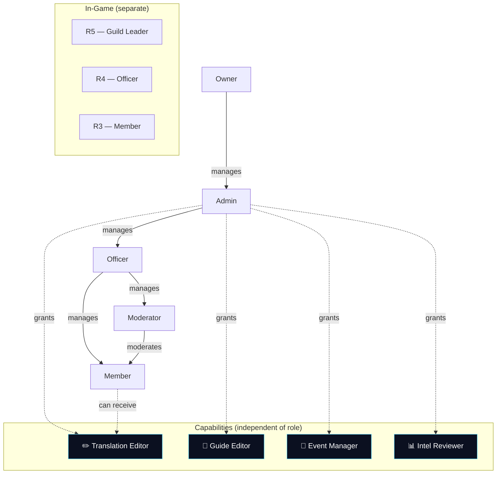

# Diagrams

## Architecture

```mermaid
graph TD
    A["📱 Browser / Mobile"] -->|loads| B["⚛️ React Frontend\nstatic files on cPanel"]
    B -->|"fetch /api/*"| C["🐘 PHP API\ncPanel / Apache"]
    C -->|SQL| D[("🗄️ MySQL\ncPanel")]
    D --> C
    C -->|JSON| B
    B -->|renders| A

    style A fill:#0b1020,color:#fff,stroke:#334
    style B fill:#0b1020,color:#fff,stroke:#61dafb
    style C fill:#0b1020,color:#fff,stroke:#8892bf
    style D fill:#0b1020,color:#fff,stroke:#f29111
```

## Phases

```mermaid
gantt
    dateFormat  YYYY-MM
    title Project Phases

    section Phase 1 — Foundation
    Setup & Architecture     :p1a, 2026-07, 2w
    Guide (mobile-optimized) :p1b, after p1a, 3w
    Operations & Events      :p1c, after p1a, 3w
    Login & Auth             :p1d, after p1b, 3w
    Roles & Capabilities     :p1e, after p1d, 2w
    UI Redesign              :p1f, after p1a, 6w

    section Phase 2 — Member Layer
    Profiles & Bookmarks     :p2a, after p1e, 3w
    Guide Comments           :p2b, after p2a, 2w
    Notifications            :p2c, after p2b, 2w

    section Phase 3 — Officer Tools
    Admin Interface          :p3a, after p2c, 4w
    Readiness Calculator     :p3b, after p3a, 2w
    Forum Basics             :p3c, after p3a, 3w
```

## Role Model

```mermaid
graph TD
    Owner -->|manages| Admin
    Admin -->|manages| Officer
    Officer -->|manages| Moderator
    Officer -->|manages| Member
    Moderator -->|moderates| Member

    subgraph "Capabilities (independent of role)"
        T["✏️ Translation Editor"]
        G["📖 Guide Editor"]
        E["📅 Event Manager"]
        I["📊 Intel Reviewer"]
    end

    Admin -.->|grants| T
    Admin -.->|grants| G
    Admin -.->|grants| E
    Admin -.->|grants| I
    Member -.->|can receive| T

    subgraph "In-Game (separate)"
        R5["R5 — Guild Leader"]
        R4["R4 — Officer"]
        R3["R3 — Member"]
    end

    style T fill:#0b1020,color:#fff,stroke:#61dafb
    style G fill:#0b1020,color:#fff,stroke:#61dafb
    style E fill:#0b1020,color:#fff,stroke:#61dafb
    style I fill:#0b1020,color:#fff,stroke:#61dafb
```
