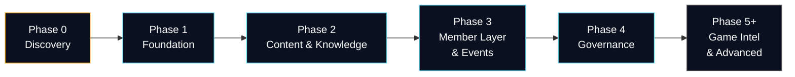
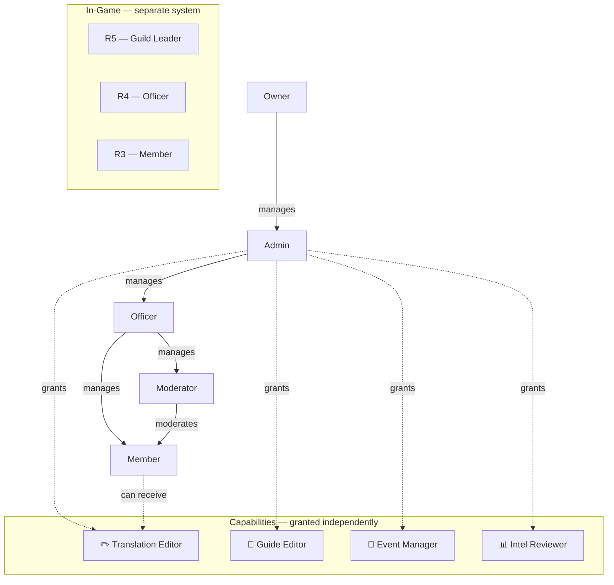

# Roadmap

## Overview

---

## Phase 0 — Discovery

Goal: understand what exists before building or replacing anything.

### Clarify access

- Canonical repo (`elevenlive/sonneark-website`) — read access for Jessy or structured export by elevenlive
- Database schema — export of current MySQL schema (no live data)
- cPanel configuration — PHP version, active extensions, directory structure
- Deployment workflow — how does an update currently reach the server?
- Flat-file structure — which files are authoritative, where do they live?

### Document the current state

- Which pages and features exist on sonneark.eu today?
- What works, what is broken, what is missing?
- Which parts of the existing site must be carried over (guide content, forum, user data)?
- Which PHP endpoints already exist?

### Record decisions

- Architecture decision record: cPanel/PHP confirmed as production baseline
- React as progressive enhancement, not SPA replacement — or explicitly decided otherwise
- Flat-file vs. MySQL per feature area
- Work through open questions from document 01 section 12

**Required before Phase 1. No implementation without this step.**

---

## Phase 1 — Foundation

Goal: a working website that guild members actually use on mobile. Stabilise what exists, full redesign, login and roles.

### Setup & Architecture

- React (Vite) frontend connected to PHP API
- MySQL schema carried over from Phase 0 discovery
- Git deployment pipeline confirmed working
- sonneark.eu serving the new frontend

### UI Redesign

The current UI is not the target state. Phase 1 includes a full visual redesign — not an incremental improvement.

- Mobile-first — readable and fast on a phone in under 3 seconds
- Dark mode as default, light mode optional
- Clean, calm, space/fleet-themed
- No cluttered admin panels, no horizontal overflow
- Cards and panels for content sections
- Consistent navigation — public content always reachable without login

### Login & Auth

Already exists — stabilise and redesign.

- Register flow cleaned up (no account enumeration, CSRF, rate limiting)
- Login UX redesigned
- Language preference and timezone stored on profile
- Secure sessions
- No game credentials collected

### Roles & Capabilities

Website roles are completely separate from in-game ranks.

Rules:
- Website Owner ≠ Guild Leader. Independent systems.
- In-game rank does not grant website authority automatically.
- A member can receive a capability (e.g. Translation Editor) without becoming an Officer.
- Last-owner protection: the Owner role cannot be removed from the last owner.
- All role and capability changes are logged.

User management is inline — click on a user, set their roles and capabilities there. No separate admin panel for this.

### Forum Cleanup

The forum already exists — clean it up, do not rebuild from scratch.

- UX overhaul: categories, thread view, replies
- Moderation actions: pin, lock, soft-hide, restore
- Permission enforcement: who can see and post what
- Guide comments use the same system

### Avatar & Profile

Avatar upload already exists but is broken — fix in Phase 1.

- Upload, crop, preview client-side
- Server-side: validate content type, re-encode, discard original
- No EXIF data in public avatars

### Guide & Operations

- Existing guide content displayed mobile-optimised
- In-page search (filter sections by keyword)
- Table of contents with scroll highlighting
- Event timers for all recurring events (static data, one-time setup)
- R4/R5 roster
- All data manually managed by officers

### Admin Panel Simplification

The existing admin panel gets cleaned up, not replaced.

- Task-centred view instead of nested settings pages
- Controlled QA users for permission testing

---

## Phase 2 — Content & Knowledge

Goal: make guild knowledge usable, searchable and maintainable.

- Guide structure: draft → review → publish workflow
- Revision history and rollback
- Glossary (standalone, searchable)
- Global permission-filtered search
- Guide-local search
- Changelog: what changed and when
- Translation workflow: preserve original text, mark machine translation, human review state, stale marker when source changes, report action for poor translations
- EN/DE first, further languages after

---

## Phase 3 — Member Layer & Events

Goal: members have a persistent identity and officers can coordinate events.

- Member profile (display name, linked game identity, language/timezone, privacy settings)
- Bookmarks and personal checklists
- Notifications — guide updates, event reminders, suggestion status changes
- Polls — event time voting, results with percentages, vote stored per member
- Event dashboard: current/next event, recommended actions
- Readiness calculator — member inputs key resource numbers (speedups, AP, fragments), gets event-specific recommendations. No screenshot pipeline needed.
- Officer notes — internal short notes per event, visible to officers only
- Commerce Guild Duel / Top 100 distinction
- Operation Blackout integration (Duel days 3–4)

---

## Phase 4 — Governance

Goal: make maintenance safe and auditable.

- Owner-only backup/recovery status (freshness, checksum, retention — without exposing backup contents)
- Release package status and rollback instructions
- Deployment gate status
- Audit log: login events, role changes, guide publications, moderation actions
- Controlled QA fixtures and direct-route tests

---

## Phase 5+ — Game Intel & Advanced (Backlog)

**Game Intel: only if manual officer entry from Phase 3 is a proven bottleneck.**

- Game-intel quarantine and review pipeline
- Neural network for screenshot analysis
- Discord bot integration
- Discord account linking
- Squad / team planner
- Officer handover log
- Mentorship directory
- Alliance-visible content layer
- Support node integration (elevenlive.eu)
- Subdomain architecture
- Optional WebSocket evaluation if polling is demonstrably insufficient
