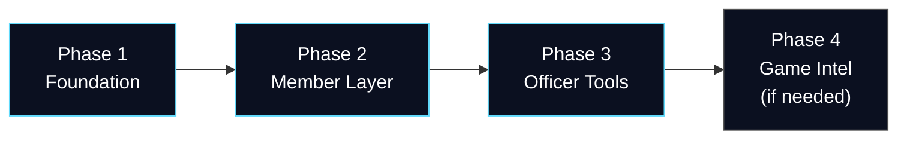
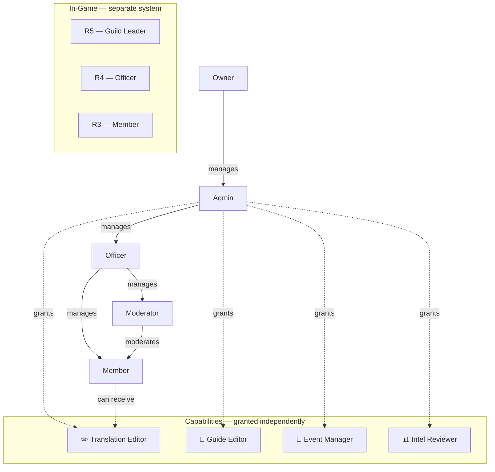

# Roadmap

## Overview

---

## Phase 1 — Foundation

Goal: a working website that guild members actually use on mobile. Everything a visitor or member needs without logging in.

### Setup & Architecture

- React (Vite) frontend connected to PHP API
- MySQL database schema established
- Git deployment pipeline confirmed working
- sonneark.eu serving the new frontend

### UI Redesign

The current UI is not the target state. Phase 1 includes a full visual redesign — not an incremental improvement.

Direction:
- Mobile-first — readable and fast on a phone in under 3 seconds
- Dark mode as default, light mode optional
- Clean, calm, space/fleet-themed
- No cluttered admin panels, no horizontal overflow
- Cards and panels for content sections
- Consistent navigation — public content always reachable without login

### Guide

- Full guide content, mobile-optimized
- In-page search (filter sections by keyword)
- Table of contents with scroll highlighting
- Multilingual — language switcher preserved
- Fast: no DB query needed for static guide content

### Operations & Events

- Event timers for all recurring events (static data, one-time setup)
- Guild-controlled event scheduling — officers set time for the 2 guild-managed events
- R4/R5 roster
- Event progress tracking
- All data manually managed by officers via admin interface

### Login & Auth

Logins are Phase 1 because they already exist on the current site and are required for member-only content.

- Registration with invite code or officer approval
- Username, password, email, language preference, timezone
- Secure sessions
- No game account passwords collected
- Registration must not reveal whether an account exists

### Roles & Capabilities

Website roles are completely separate from in-game ranks.

Rules:
- Website Owner ≠ Guild Leader. These are independent.
- In-game rank does not grant website authority automatically.
- A member can receive a capability (e.g. Translation Editor) without becoming an Officer.
- Last-owner protection: the Owner role cannot be removed from the last owner.
- All role/capability changes are logged.

User management is inline — click on a user, set their roles and capabilities there. No separate admin panel for this.

---

## Phase 2 — Member Layer

Goal: members have a persistent identity on the platform.

- Member profile (display name, linked game identity, language/timezone, privacy settings)
- Avatar upload with crop and re-encode — original discarded, no executable files accepted
- Bookmarks and personal checklists
- Guide comments and suggestions (moderated)
- Notifications — guide updates, event reminders, suggestion status changes
- Polls — event time voting, results with percentages, vote stored per member

---

## Phase 3 — Officer Tools

Goal: officers can manage content without developer involvement.

- Admin interface for event timers, roster, progress updates
- Guide draft → review → publish workflow with revision history
- Readiness calculator — member inputs key resource numbers (speedups, AP, fragments), gets event-specific recommendations. No screenshot pipeline needed.
- Forum basics — categories, threads, replies, moderation
- Translation correction workflow — members with Translation capability can fix bad machine translations

---

## Phase 4 — Game Intel

**Trigger: only if manual data entry in Phase 3 is a proven bottleneck.**

The game is mobile-first. Most players play on mobile and rarely leave the game. A PC companion app or screenshot pipeline reaches a small fraction of the player base and adds significant friction.

Approach if triggered:
- Start with manual officer entry for member rankings and scores
- Evaluate screenshot-based OCR for leaderboard screens only (not inventory)
- Assess actual usage before building any automated pipeline

---

## Backlog

Items with no assigned phase. Only worth building if the platform has proven active use.

- Neural network for screenshot analysis
- PC companion app for inventory data
- Discord bot integration
- Discord account linking
- Alliance-visible content layer
- Squad / team planner
- Officer handover log
- Mentorship directory
- Game-intel quarantine and review pipeline
- Backup / recovery center
- Support node integration (elevenlive.eu)
- Subdomain architecture
